Windows タスクマネージャーライクのタスク管理ソフト PCMgr フォーク版

## 概要

Windows タスクマネージャーライクのタスク管理アプリです。標準のタスクマネージャーにはない機能を追加しつつ、見た目・操作感を近づけています。WinAPI および C# で開発されており、プロセスの表示・詳細確認・終了などが行えます。

> **元リポジトリ:** [imengyu/PCMgr](https://github.com/imengyu/PCMgr) (作者: imengyu)  
> このリポジトリはフォークです。

## 機能

- プロセス一覧の表示・終了・一時停止・再開
- プロセスのスレッド・モジュール・ウィンドウ・ハンドルの表示
- パフォーマンスグラフ（CPU / メモリ / ディスク / ネットワーク）
- システムサービスの管理
- 完全オープンソース

## 動作環境

- Windows 10/11
- .NET Framework 4.8 以降

## ダウンロード

ビルド済みバイナリ（元リポジトリ版）:

- [x86 版をダウンロード](https://github.com/imengyu/PCMgr/raw/master/Release/Release_x86_1.3.2.6.zip)
- [x64 版をダウンロード](https://github.com/imengyu/PCMgr/raw/master/Release_64/Release_64_1.3.2.6.zip)

インストール・ビルド手順の詳細は [Install.md](Install.md) を参照してください。

## ビルドと起動

C++ ローダーはビルド済みバイナリを使用し、C# 部分（`PCMgrApp32.dll`）を dotnet CLI でビルドします。

### 必要なツール

- [.NET SDK 8.0](https://dotnet.microsoft.com/download)
- .NET Framework 4.8（Windows 10/11 に標準搭載）

### 手順

```powershell
.\run64.ps1
```

> プロセスの終了・一時停止など管理機能は管理者権限が必要です。  
> 詳細は [Install.md](Install.md) を参照してください。

## スクリーンショット

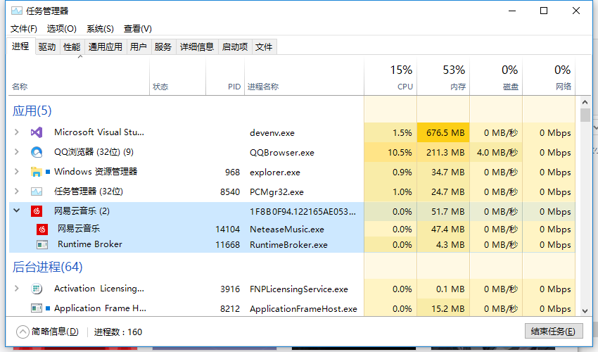
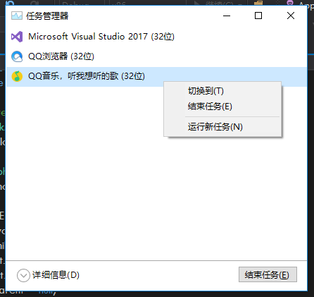
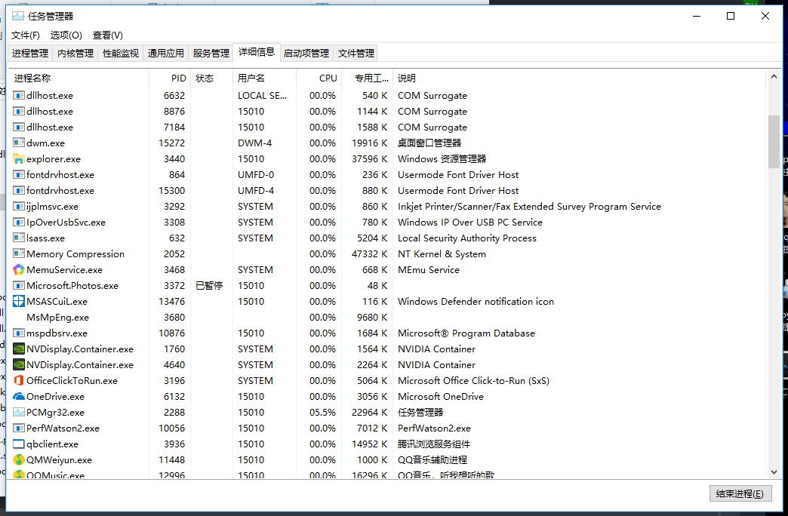
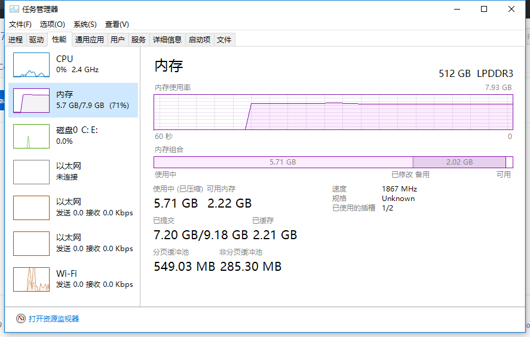
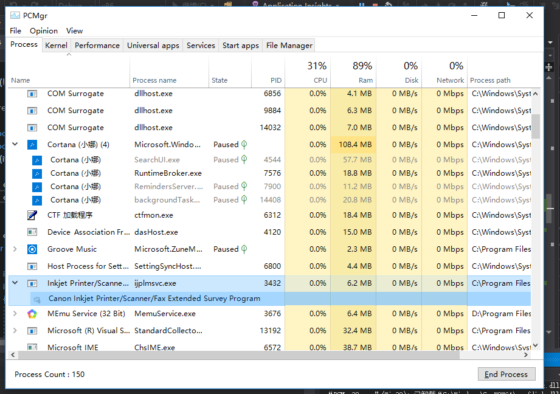
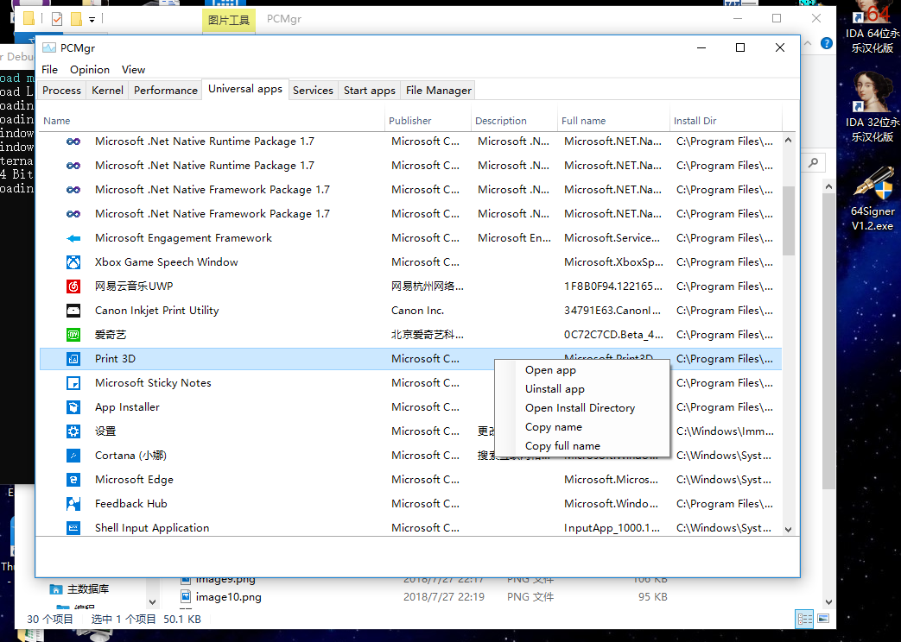
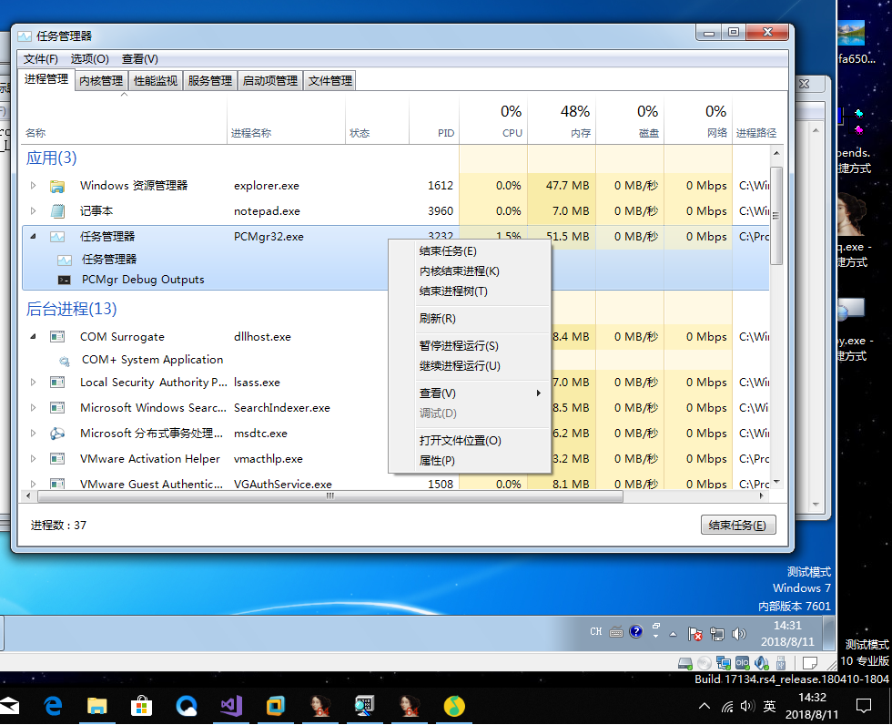
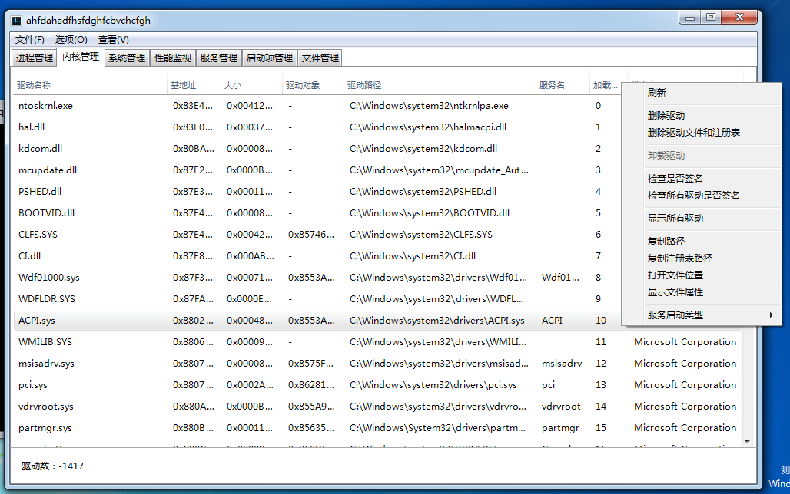
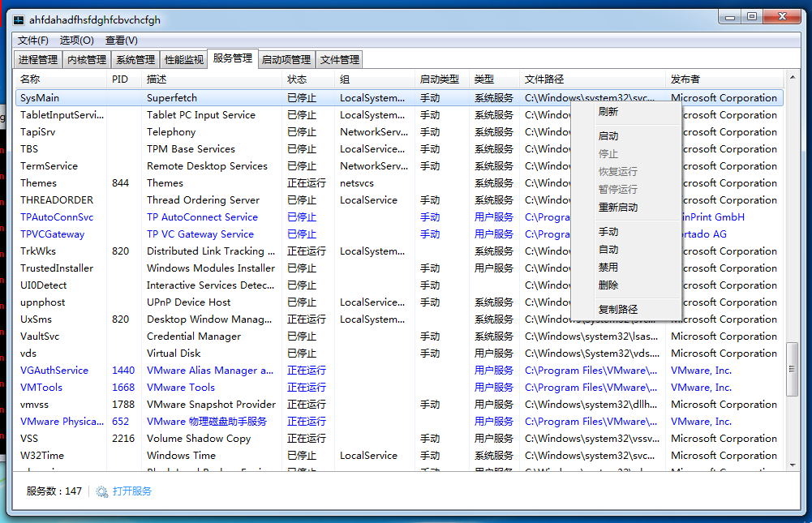
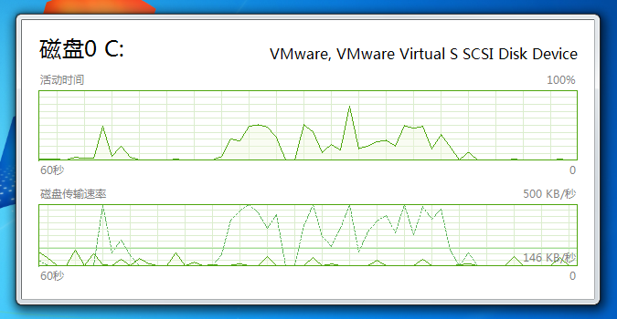
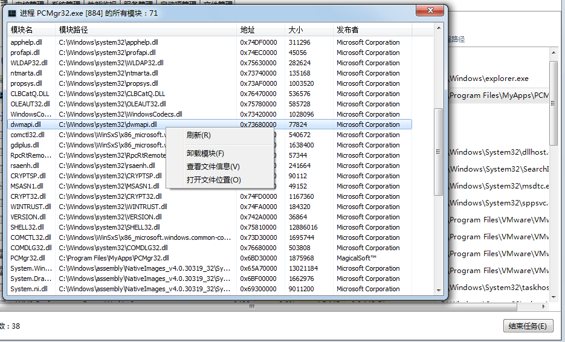

## ライセンス

MIT License — 詳細は [LICENSE](LICENSE) を参照してください。
